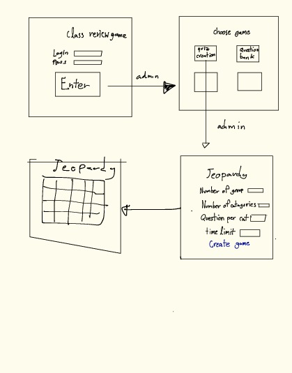

# Project vision

## WHO is the customer

Instructors

## WHAT is their need

The instructor want to play games with students in class but he had several problems:

- The classroom is large and the students are not sitting together, for that, he doesn't know who rang in first.
- The design of the existing software is not attractive for the students.
- He wants the students to be able to join remotely too.
- He wants the students to answer in a short period of time after ringing in. On the other hand, he doesn't want to use a stopwatch

With these problems cause him to have a hard time holding class activities.

Our solution will make the class activity look more interesting, fun and easy to held.

